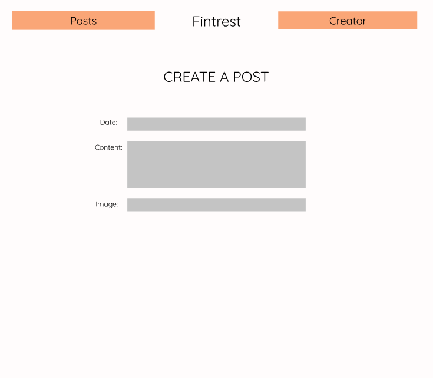

# Project 4 - Pintrest Clone (Fintrest)
### --------------------------------------------------------------------------------------------
### Purpose
The problem is that a user wants to be able to easily create and share content that they think other users would find useful, as well as being able to then view other's created content, specifically content for how to do a variety of things.
### --------------------------------------------------------------------------------------------
### Target End User
The Target End User is intended to be someone who wants to be able to view content that can help them do something, such as recipes, do it yourself projects, and even memes. The user also is intended to be one who wants to create this content. 
### --------------------------------------------------------------------------------------------
### GitHub Projects Link
[GitHub Projects Link](https://github.com/bakercharles14/fintrest-project-4/projects/1)
### --------------------------------------------------------------------------------------------
### Heroku Deployed App Link
[Heroku App Link](https://fintrest.herokuapp.com/)
### --------------------------------------------------------------------------------------------
### Wire Frame Images
                              

### --------------------------------------------------------------------------------------------
# ERD Image

### --------------------------------------------------------------------------------------------